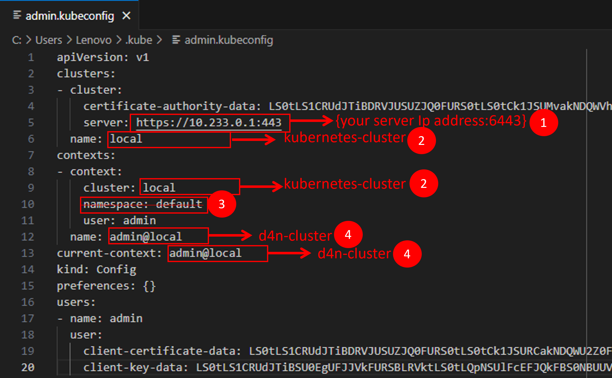

# 7. Configuring Kubectl on the Workstation

This section provides guidance on configuring `kubectl` on the workstation, ensuring connectivity with the Kubernetes cluster. The process varies based on whether `kubectl` is newly installed or if an existing configuration is present.

## 7.1. Configuration for a Newly Installed Kubectl

### 7.1.1. Download the kubernetes config file from the cluster

```powershell
## Create the .kube directory to store configuration files
C:\>mkdir $HOME\.kube
## Copy the kubeconfig file from the master node to the local workstation
C:\>scp root@$Env:D4N_MASTER_IP_ADDRESS:/etc/kubernetes/admin.conf $HOME\.kube\config
## Verify the cluster connection by checking available contexts
C:\>kubectl config get-contexts
## Verify that the cluster nodes are accessible
C:\>kubectl get nodes
```

### 7.1.2. Edit/Modifying the Kubeconfig File

The kubeconfig file should be updated as shown below:



### 7.1.3. Verify the access to the cluster

```powershell
## Verify the Cluster Connection Again
C:\>kubectl config get-contexts
C:\>kubectl get nodes
```

## 7.2. Configuration When an Existing Cluster is Already Set Up

If the workstation already has an existing Kubernetes cluster configuration, follow these steps to merge the new kubeconfig file.

### 7.2.1. Download the kubernetes config file from the cluster

```powershell
## Copy the new kubeconfig file from the master node to the local workstation
C:\>scp root@$Env:D4N_MASTER_IP_ADDRESS:/etc/kubernetes/admin.conf $HOME\.kube\new-config
```

### 7.2.2. Modifying the `new-config` File

The `new-config` file should be edited as illustrated below:


### 7.2.3. Merge both the new and current config files

```powershell
## Temporarily set the KUBECONFIG environment variable to include both configurations
C:\>$Env:KUBECONFIG="$HOME\.kube\config;C:\$HOME\.kube\new-config"
## Backup the existing configuration file before making changes
C:\>cp $HOME\.kube\config $HOME\.kube\config.bak
## Merge the new kubeconfig file with the existing one
C:\>kubectl config view --flatten > $HOME\.kube\config.merged
## Replace the default kubeconfig file with the merged configuration
C:\>mv -Force $HOME\.kube\config.merged  $HOME\.kube\config
## Remove the temporary new-config file
C:\>Remove-Item -Path $HOME\.kube\new-config
## Reset the KUBECONFIG environment variable to point to the final configuration
C:\>$Env:KUBECONFIG = "$HOME\.kube\config"
```

### 7.2.4. Verify the access to the cluster

```powershell
## Verify the Cluster Connection After Merging
C:\>kubectl config get-contexts
## Set the default context to the appropriate Kubernetes cluster
C:\>kubectl config use-context <context-name>
## Verify that the nodes are accessible
C:\>kubectl get nodes
```


