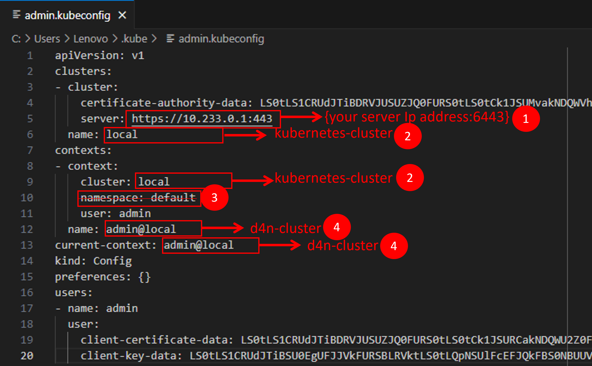

# Configure Kubectl workstation


## Newly installed kubectl 

```powershell
## create the .kube folder
mkdir $HOME\.kube
## Copy the New kubeconfig File Locally 
scp root@{master_ip_address}:/etc/kubernetes/admin.conf $HOME\.kube\config
## Verify the Cluster Connection
kubectl config get-contexts
kubectl get nodes
```

Edit the kubeconfig file as 



```powershell
## Verify the Cluster Connection
$kubectl config get-contexts
$kubectl get nodes
```

## Already have existing cluster(s) configured

```powershell
## kubeconfig File Locally
scp root@{master_ip_address}:/etc/kubernetes/admin.conf $HOME\.kube\new-config
```

Edit the `new-confi` config file


```powershell
## Merge the New kubeconfig with the Existing One
$env:KUBECONFIG="$HOME\.kube\config;C:\$HOME\.kube\new-config"
##backup config file 
cp $HOME\.kube\config $HOME\.kube\config.bak
## merge the file into a merge config file
kubectl config view --flatten > $HOME\.kube\config.merged
## replace the default condif by the merged one
mv -Force $HOME\.kube\config.merged  $HOME\.kube\config
## set back kubconfig environment back to the default value
$Env:KUBECONFIG = "$HOME\.kube\config"
## Verify the Cluster Connection
kubectl config get-contexts
kubectl config use-context <context-name>
kubectl get nodes
```
